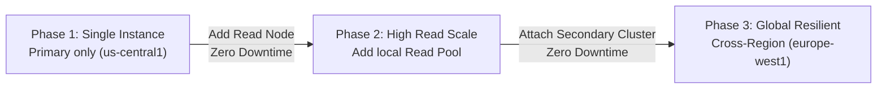

# AlloyDB Multi-Region Resiliency and Failover Plan
## HR Vacation Request Subsystem

This document outlines the architectural plan, disaster recovery runbook, and progressive upgrade path for migrating the **HR Vacation Request Subsystem** database tier to **Google Cloud AlloyDB**. It provides a high-performance PostgreSQL-compatible environment while maintaining regional resilience with a scripted cross-region failover model.

---

## 1. Multi-Region Cluster Architecture

AlloyDB uses a **Primary/Secondary Cluster** pattern to scale globally and provide regional disaster recovery:

```mermaid
flowchart TD
    User["User Browser"] -->|HTTPS| GCLB["Global HTTPS Load Balancer"]
    GCLB -->|IAP| FE_US["Cloud Run Frontend (us-central1)"]
    GCLB -->|IAP| FE_EU["Cloud Run Frontend (europe-west1)"]

    subgraph us_region["Primary Region: us-central1 (Primary Cluster)"]
        FE_US -->|Private Connection| BE_US["Cloud Run Backend (us-central1)"]
        BE_US -->|Write Queries| DNS_W["write-db.hr-vacation.internal"]
        BE_US -->|Read Queries| DNS_R["read-db.hr-vacation.internal"]
        
        DNS_W -->|Resolves to Primary IP| ALL_PRI["AlloyDB Primary Instance (Read-Write)"]
        DNS_R -->|Resolves to Local Read Pool IP| ALL_POOL["AlloyDB Read Pool Instance (Read-Only)"]
    end

    subgraph eu_region["Secondary Region: europe-west1 (Secondary Cluster)"]
        FE_EU -->|Private Connection| BE_EU["Cloud Run Backend (europe-west1)"]
        BE_EU -->|Write Queries| DNS_W
        BE_EU -->|Read Queries| DNS_R
        
        %% Local Read Path in Europe
        DNS_R -.->|In Europe: Resolves to Local Secondary IP| ALL_SEC["AlloyDB Secondary Instance (Read-Only)"]
    end

    %% Database replication link
    ALL_PRI -->|Storage-Level Log Streaming (Asynchronous)| ALL_SEC
```

### Components
*   **Primary Cluster (`us-central1`)**: Houses the primary read-write instance and optional read-pool instances for local read scaling.
*   **Secondary Cluster (`europe-west1`)**: Houses a read-only secondary instance that asynchronously replicates transactions from the primary cluster.
*   **Storage-Log Streaming**: Replication is offloaded to AlloyDB's distributed storage layer. WAL logs are streamed asynchronously between regions, maintaining typical replication lag under **1 second** with zero CPU impact on the compute instances.

---

## 2. Zero-Code-Change Failover Strategy

To enable the operations team to handle regional failovers and database promotion without touching application code, modifying environment variables, or redeploying services, we leverage **Private Google Cloud DNS**.

### 2.1 Private DNS Mapping
The application is configured to connect to two logical hostnames rather than hardcoded IP addresses:

```env
# Application Database Connection Endpoints
DB_WRITE_HOST="write-db.hr-vacation.internal"
DB_READ_HOST="read-db.hr-vacation.internal"
```

Within Google Cloud DNS, a Private DNS Zone (`hr-vacation.internal`) is mapped to the VPC.

#### Normal Operations DNS Resolution:
*   **`write-db.hr-vacation.internal`**: Resolves globally to the **AlloyDB Primary Instance IP** in `us-central1`.
*   **`read-db.hr-vacation.internal`**: Resolves regionally:
    *   For US compute instances: Resolves to the **AlloyDB US Read Pool IP**.
    *   For European compute instances: Resolves to the **AlloyDB European Secondary Instance IP**.

---

## 3. Disaster Recovery (DR) Runbook

In the event of a regional disaster, the operations team follows these steps to restore database availability.

### Scenario A: Primary Region (`us-central1`) Outage
If the primary region goes offline, the European backend can still perform reads locally, but all write transactions fail.

#### Failover Action Plan:
1.  **Verify Outage**: Ensure that the primary region is completely unrecoverable or that recovery will exceed the target RTO.
2.  **Promote the Secondary Cluster**: Run the gcloud CLI command to promote the European secondary cluster to a standalone primary cluster:
    ```bash
    gcloud alloydb clusters promote-secondary hr-vacation-cluster-eu \
        --region=europe-west1 \
        --project=your-project-id
    ```
    *This command stops replication, detaches the European cluster, and transitions it to read-write mode in 1-2 minutes.*
3.  **Update DNS Record**: Update the private Cloud DNS zone to reroute write traffic to the new European master:
    *   Update `write-db.hr-vacation.internal` $\rightarrow$ Point to the **European Cluster IP**.
    *   Update `read-db.hr-vacation.internal` (US region record, if any US instances survive) $\rightarrow$ Point to the **European Cluster IP**.
4.  **Result**: The running compute instances automatically resolve the new IP address as their internal DNS caches expire and database connection pools recycle. **Zero code changes, zero redeployments.**

### Scenario B: Secondary Region (`europe-west1`) Outage
If the European datacenter goes offline, the US primary remains healthy, but the European backend cannot perform local reads.

#### Failover Action Plan:
1.  **Update DNS Record**: Update the European DNS routing record for `read-db.hr-vacation.internal`:
    *   Update `read-db.hr-vacation.internal` $\rightarrow$ Point to the **US Primary Cluster IP** or **US Read Pool IP**.
2.  **Result**: The European backend shifts read queries to the US primary database, maintaining complete availability with slightly higher cross-ocean latency. No database promotion or write-path change is required.

---

## 4. Progressive Upgrade Path (Zero Downtime)

AlloyDB's decoupled compute-and-storage architecture allows you to start small and scale dynamically as business and resilience requirements increase, completely without downtime or migrations.



### Phase 1: Dev & Initial Rollout (Single Instance)
Deploy a single AlloyDB cluster with a single primary read-write instance.
*   **Resilience**: Zonal resilience only.
*   **Cost**: Minimum footprint (1 compute node + shared storage).

### Phase 2: Local Read Scaling (Read Pool Upgrade)
As read traffic increases in the primary region, add a Read Pool instance to the existing cluster.
*   **How**: Spin up a stateless PostgreSQL compute node.
*   **Impact**: **Zero Downtime**. Because storage is shared, no data needs to be copied. The new instance is online and serving reads in minutes.

### Phase 3: Global Resiliency & DR (Cross-Region Upgrade)
Attach a secondary cluster in `europe-west1` to transition the architecture to the fully resilient multi-region topology.
*   **How**: Provision an AlloyDB Secondary Cluster in the target region pointing to the primary cluster.
*   **Impact**: **Zero Downtime** on your active US primary. Storage log replication automatically syncs historical and incoming transaction data across the globe. Once synced, add a Secondary Instance to start serving European reads locally.
