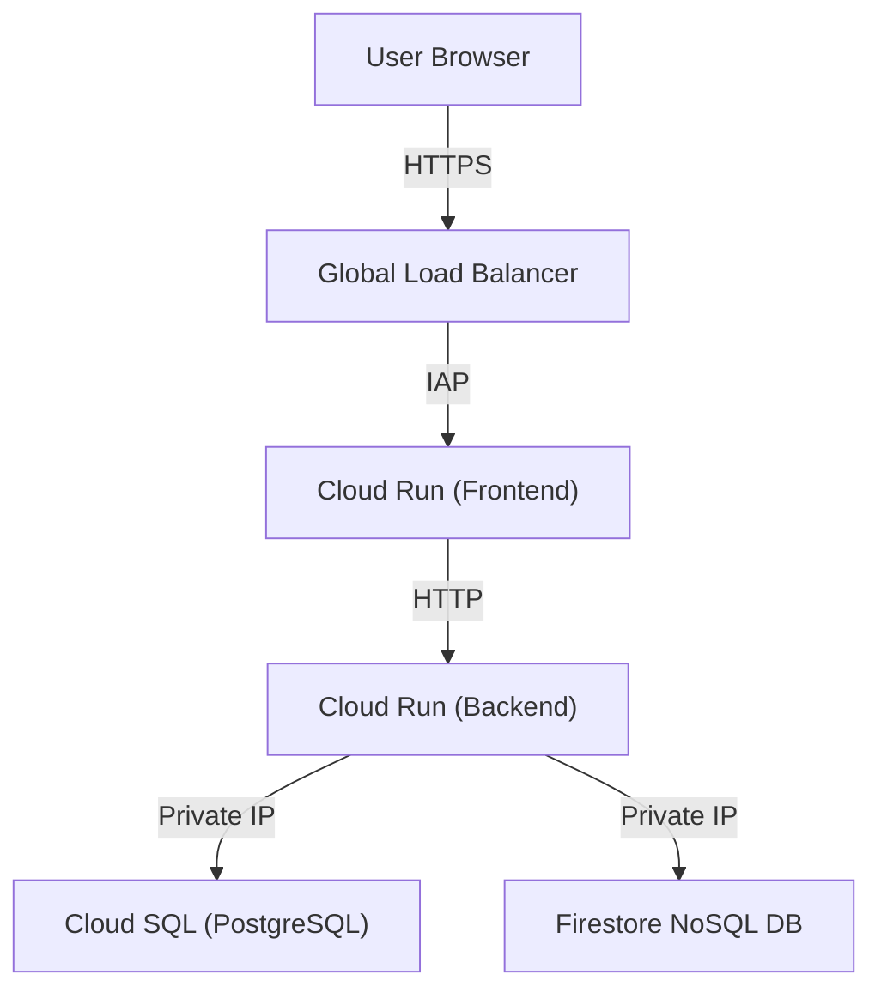
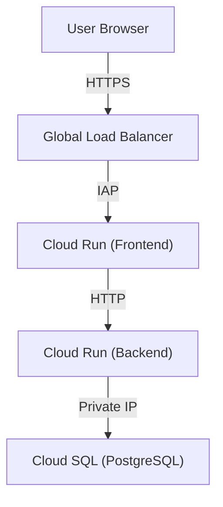

# Plan: Remove Firestore and Consolidate to Cloud SQL (PostgreSQL)

This plan outlines the steps required to remove Firestore (NoSQL Document Store) from the HR Vacation application. To simplify the application topology and lower operational overhead, we will consolidate all state storage into **Cloud SQL (PostgreSQL)**. 

---

## 1. Executive Summary

The current architecture uses a dual-database approach:
1. **Cloud SQL (PostgreSQL)**: Handles employee records, accrual balances, and department metadata.
2. **Cloud Firestore**: Handles asynchronous workflow states (`/workflows`) and system notifications (`/notifications`).

By migrating the workflow and notification models into relational tables inside **Cloud SQL (PostgreSQL)**, we achieve:
- **Simplified Topology**: Eliminating an entire managed database resource from our Google Cloud footprint.
- **Cost Reduction**: Lowering GCP resource costs by removing Native Firestore.
- **Improved Consistency**: Consolidating transactions into a single relational database, enabling ACID compliance across both employee balances and approval workflows.
- **Unified Inspector**: Providing students with a single, comprehensive SQL console to inspect all relational tables.

---

## 2. Architecture Comparison

### Current Architecture

### Proposed Consolidated Architecture

---

## 3. Inventory of Firestore References

Below is a detailed list of all locations in the codebase where Firestore is referenced or utilized:

| File | Line(s) | Description / Usage |
| :--- | :---: | :--- |
| **`README.md`** | 17 | Explains Firestore NoSQL database for workflows and notifications. |
| **`README.md`** | 26 | Describes traffic routing to relational Cloud SQL and NoSQL Firestore collections in network topology description. |
| **`README.md`** | 29 | Mentions "Mock Firestore Document Tree". |
| **`README.md`** | 76 | Mentions "Native Firestore" in the Terraform provisioning outline. |
| **`terraform/main.tf`** | 89-97 | Defines the `google_firestore_database.firestore` resource. |
| **`server.js`** | 10 | Code comment references mock Cloud SQL & Firestore. |
| **`server.js`** | 16-17 | Inline mock databases: `workflows` and `notifications` variables. |
| **`server.js`** | 60-103 | In-memory database initialization, seeding mock Firestore documents, and logging Firestore transaction events. |
| **`server.js`** | 334 | Comment on creating document in Firestore `/workflows`. |
| **`server.js`** | 363-364, 379 | NoSQL style logging (`db.collection().set(...)`) for workflow and notification creation. |
| **`server.js`** | 440-441, 454 | NoSQL style logging for workflow updates (approvals). |
| **`server.js`** | 461-462, 475 | NoSQL style logging for workflow updates (rejections). |
| **`public/index.html`** | 7 | Meta description tag mentioning "Firestore". |
| **`public/index.html`** | 177-178 | SVG path comment and ID `path-be-fs` for backend-to-firestore communication. |
| **`public/index.html`** | 223-228 | SVG node element (`#node-fs`) representing Firestore in the topology map. |
| **`public/index.html`** | 236 | SVG packet element (`#packet-be-fs-c`) for database traffic animation. |
| **`public/index.html`** | 296, 308-315 | "Firestore NoSQL Documents" database console tab and pane. |
| **`public/index.html`** | 381-391 | Challenge 3: "Active-Active Workflow Synced Firestore" Lab Card. |
| **`public/index.css`** | 642-644 | Styling rule for `.log-entry.log-firestore` entries. |
| **`public/app.js`** | 211 | Placeholder message text: "No time-off requests are active in the Firestore state database." |
| **`public/app.js`** | 287 | Transaction logs parsing/formatting condition for `firestore` logs. |
| **`public/app.js`** | 563, 584 | Code comments/labels displaying Firestore collection formats in console rendering. |

---

## 4. Step-by-Step Refactoring Plan

### Step 1: Infrastructure Cleanup (Terraform)
We will remove the Firestore resource declaration from the infrastructure definitions.
- **File**: `terraform/main.tf`
- **Action**: Completely delete the `resource "google_firestore_database" "firestore"` block (lines 89–97).
- **Impact**: Prevents Terraform from provisioning Native Firestore in Google Cloud, ensuring we don't pay for unused database instances.

### Step 2: Relational Data Model Consolidation (Backend)
We will convert the mock `workflows` and `notifications` in-memory structures to represent relational tables in PostgreSQL instead of collections in Firestore.
- **File**: `server.js`
- **Actions**:
  1. Update comments at lines 10, 16, and 17 to describe relational table structures:
     - `workflows` table schema: `id (PK), employee_id (FK), employee_name, sector, country, start_date, end_date, days_requested, status, current_step, approval_chain, reason, created_at, updated_at`
     - `notifications` table schema: `id (PK), user_id (FK), message, read, created_at`
  2. Rewrite the database initialization log entries in `resetDatabase()` (lines 95 and 102) from NoSQL references to SQL queries:
     - `INSERT INTO workflows ...`
     - `INSERT INTO notifications ...`
  3. Replace NoSQL style mock logs in `app.post('/api/requests')`, `/api/requests/:id/approve`, and `/api/requests/:id/reject` to show mock relational SQL queries:
     - Change `Firestore: db.collection("workflows").doc(...).set(...)` to SQL equivalents: `INSERT INTO workflows (id, employee_id, ...) VALUES (...)`.
     - Change `Firestore: db.collection("workflows").doc(...).update(...)` to: `UPDATE workflows SET status = 'approved', current_step = 'completed' WHERE id = ...`.
     - Change type identifier of logs from `'firestore'` to `'sql'` so they feed into the SQL console feed.

### Step 3: Frontend UI Elements Refactoring (HTML)
We will remove the visual references to Firestore, simplify the database inspector, and update the lab challenge.
- **File**: `public/index.html`
- **Actions**:
  1. **Meta Description** (Line 7): Remove "Firestore" and adjust description to: "...showing Cloud Run, Cloud SQL, and Private VPC connections in action."
  2. **Network Topology SVG** (Lines 177–178, 223–228, 236):
     - Delete the `<path id="path-be-fs" ...>` connection path.
     - Delete the `<g class="svg-node" ... id="node-fs">` group completely (removing the physical Firestore box from the VPC map).
     - Delete the `<circle id="packet-be-fs-c" ...>` packet animation node.
     - *(Optional)* Resize the remaining Cloud SQL box or paths to center them nicely if aesthetic spacing is affected.
  3. **Database Inspector Tabs** (Lines 296, 308-315):
     - Delete the `<button class="db-tab-btn" id="db-tab-fs">` element.
     - Delete the `
` element.
     - Modify the SQL tab label or sub-header description to indicate that the database now contains the `workflows` and `notifications` tables.
  4. **Student Lab Challenges** (Lines 381–391):
     - Remove the Firestore active-active dual-region replication Lab Card (Challenge 3).
     - Relabel "Challenge 4: Decipher and Validate IAP JWT Header" to "Challenge 3" to maintain numerical order.

### Step 4: Frontend Styles & Scripting Cleanups (CSS & JS)
We will align the script logic with the HTML changes and remove unused styles.
- **Files**: `public/index.css`, `public/app.js`
- **Actions**:
  1. **Styles**: In `public/index.css`, remove the `.log-entry.log-firestore` rule (or alias it to `.log-entry.log-sql` to prevent CSS breakages if legacy logs exist).
  2. **JavaScript logic**:
     - Remove Firestore tab switching handlers (`#db-tab-fs` event listeners).
     - Remove Firestore console renderer functions (`renderFSConsole`).
     - Move the UI rendering of workflows and notifications to show inside the SQL tables console interface as tables (`workflows` and `notifications`) instead of NoSQL JSON trees.
     - Update string placeholders (like "No active requests in Firestore") to "No active requests in the relational state database."

### Step 5: Document Cleanup (README)
We will update the architecture guides.
- **File**: `README.md`
- **Action**: Remove references to NoSQL/Firestore from the architecture summary list and description of components.

---

## 5. Testing and Verification Plan

To ensure the refactoring has been performed correctly and without regressions:
1. **Local Server Run**: Start the Node.js server (`npm run dev` or `node server.js`) and ensure there are no startup errors.
2. **Database Console Integration**: Navigate to the Database Inspector in the UI. Ensure that the Cloud SQL tab is functioning and that workflows/notifications tables render properly as relational models.
3. **Submit Time-Off Request Flow**: Submit a request through the HR portal. Ensure that:
   - The transaction logs pane updates with relational SQL logs (`INSERT INTO workflows...`, `INSERT INTO notifications...`).
   - The animated packet triggers toward **Cloud SQL** instead of trying to animate toward a non-existent Firestore node.
   - Accrual balance tables and workflow status grids update correctly.
4. **IAP & Verification Checks**: Verify that none of the JWT header validations or authentication pathways are broken.
5. **Terraform Validate**: Run `terraform validate` inside the `terraform/` directory to ensure the removal of the database resource is syntactically sound.
